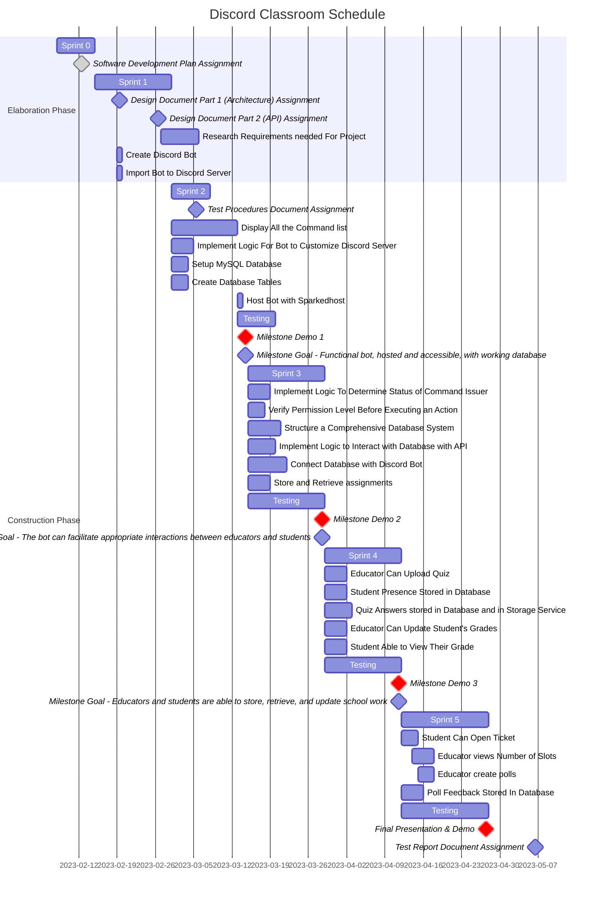

# Schedule

# Milestones

## Milestone Demo 1

* Discord bot sets up the channel with preset Categories, Text Channels, Voice channels, and Roles

    * Assigns the owner of the Discord the educator role
    
    * Allows students to pick their sections within the "role" text channel
    
    * When the bot joins the discord server, it automatically sets up separate channels for the users
    
    * Educator can use `/ta` command to give users the Assistant role

* Educator uses the `/syllabus` command to upload the syllabus to the dsicord server

    * Bot reads the pdf file attachment with the `/syllabus` command
    
    * Bot parses through the PDF to print a text version of the syllabus to discord

* Help command for users to know how certain commands work

    * Discord command for `/help` with optional arguments
    
    * If an argument is given, it returns the syntax for that argument

* Poll command used by users to create polls for users to vote through reactions

    * The command itself implemented within the bot

    * Takes two required and more optional arguments for each option

    * The bot reacts to the poll it creates so the users can click on each reaction

## Milestone Demo 2

* Educator can create content for the classroom such as Assignments, Quizzes, and Discussions

    * `/assignment` command available to educators

    * `/quiz` command available to educators

    * `/discussion` command available to educators

* Educators can start lectures within the Discord voice channel

    * attendance command used to track which students attended the lecture

    * command to announce to the discord server that a lecture is about to start

## Milestone Demo 3

* Students can submit classroom work such as Assignments, Quizzes, and Discussions

    * `/submit` command for assignments

    * `/start` command for quizzes

* Teachers can look at the work students submitted and grade them

    * `/grade` command for educators

    * `/grades` command for students to check their grade

## Milestone Demo FINAL

* The bot can join multiple servers without conflicts between servers

    * Database is set up in a way to avoid conflicts

* Polished UI

    * All bot responses look professional with no spelling/grammar errors

* All testing commands removed
