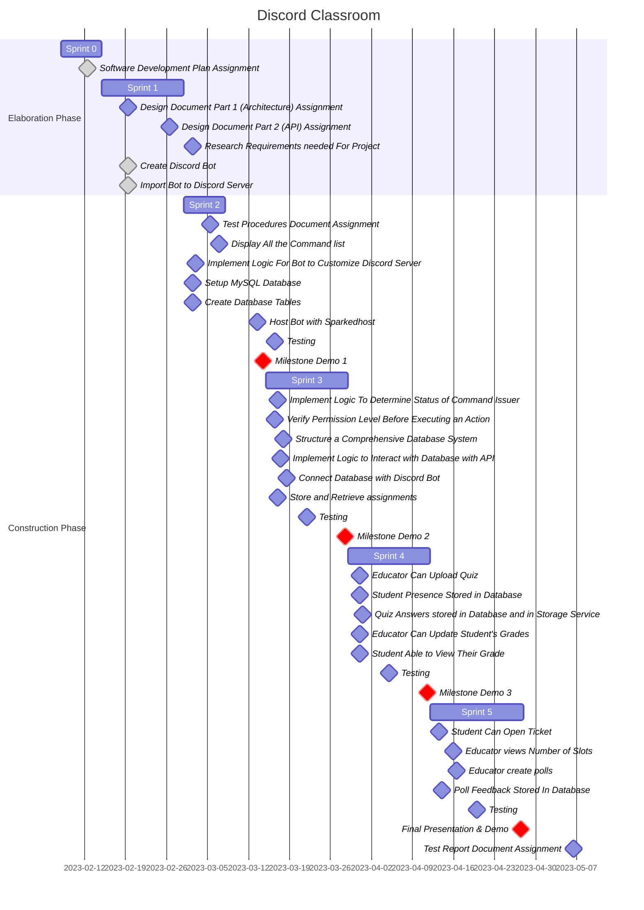

# Schedule

```mermaid
gantt
    title Discord Classroom
    dateFormat  YYYY-MM-DD
    
    section Elaboration Phase 
         Sprint 0: , 2023-02-08, 1w
         Software Development Plan Assignment: milestone, done, 2023-02-12, 1d

         Sprint 1: , 2023-02-15, 2w
         Design Document Part 1 (Architecture) Assignment: milestone, , 2023-02-19, 1d
         Design Document Part 2 (API) Assignment: milestone, , 2023-02-26, 1d
         Research Requirements needed For Project : milestone, , 2023-02-27, 1w
         Create Discord Bot : milestone, done, 2023-02-19, 1d
         Import Bot to Discord Server: milestone, done, 2023-02-19, 1d

        section Construction Phase 
         Sprint 2: , 2023-03-01, 1w
         Test Procedures Document Assignment: milestone, , 2023-03-05, 1d 
         Display All the Command list: milestone, , 2023-03-01, 12d
         Implement Logic For Bot to Customize Discord Server : milestone, , 2023-03-01, 4d
         Setup MySQL Database: milestone, , 2023-03-01, 3d
         Create Database Tables : milestone, , 2023-03-01, 3d 
         Host Bot with Sparkedhost : milestone, , 2023-03-13, 1d
         Testing : milestone, , 2023-03-13, 1w

         Milestone Demo 1 :crit, milestone,  , 2023-03-14, 1d
         
         Sprint 3: , 2023-03-15, 2w
         Implement Logic To Determine Status of Command Issuer: milestone, , 2023-03-15, 4d
         Verify Permission Level Before Executing an Action: milestone, , 2023-03-15, 3d
         Structure a Comprehensive Database System: milestone, , 2023-03-15, 6d 
         Implement Logic to Interact with Database with API: milestone, , 2023-03-15, 5d
         Connect Database with Discord Bot : milestone, , 2023-03-15, 1w 
         Store and Retrieve assignments: milestone, , 2023-03-15, 4d
         Testing : milestone, , 2023-03-15, 2w

         Milestone Demo 2 :crit, milestone,  , 2023-03-28, 1d

         Sprint 4: , 2023-03-29, 2w
         Educator Can Upload Quiz: milestone, , 2023-03-29, 4d
         Student Presence Stored in Database: milestone, , 2023-03-29, 4d
         Quiz Answers stored in Database and in Storage Service: milestone, , 2023-03-29, 5d
         Educator Can Update Student's Grades: milestone, , 2023-03-29, 4d
         Student Able to View Their Grade: milestone, , 2023-03-29, 4d
         Testing : milestone, , 2023-03-29, 2w

         Milestone Demo 3 :crit, milestone,  , 2023-04-11, 1d
         
         Sprint 5: , 2023-04-12, 16d
         Student Can Open Ticket: milestone, , 2023-04-12, 3d
         Educator views Number of Slots: milestone, , 2023-04-14, 4d
         Educator create polls: milestone, , 2023-04-15, 3d
         Poll Feedback Stored In Database: milestone, , 2023-04-12, 4d
         Testing : milestone, , 2023-04-12, 16d

         Final Presentation & Demo :crit, milestone,  , 2023-04-27, 1d
         Test Report Document Assignment: milestone, , 2023-05-06, 1d
```
