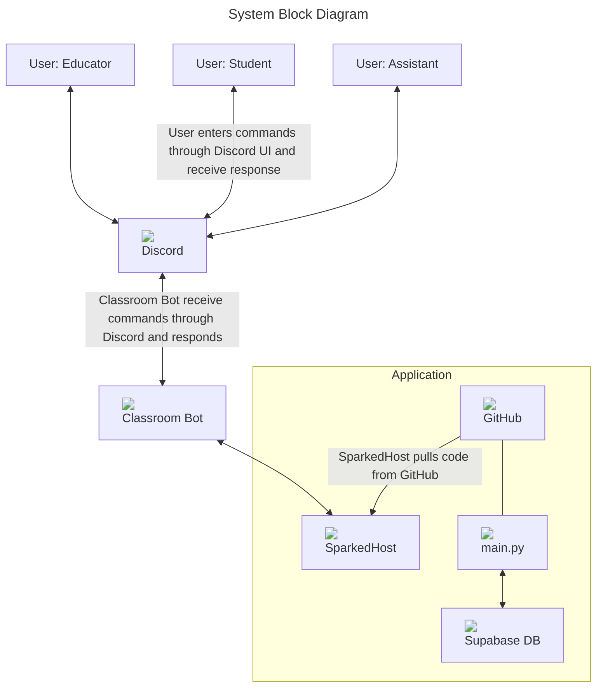

# System Block Diagram

The System Block Diagram involves two sections, the application side and the UI side. First, Discord is used as the user interface in order to interact with the application. Each user has a role which decides what commands they have access to, the roles being Educator, Assistant, and Student. When a command is typed the message is read by the bot and anaylzed by the bot. The bot then sends an appropriate response. The application is hosted on SparkedHost which pulls the code directly from GitHub repo's main branch. Within GitHub is the main.py file which is ran on the server. main.py also connects to a Supabase Database through a library.
