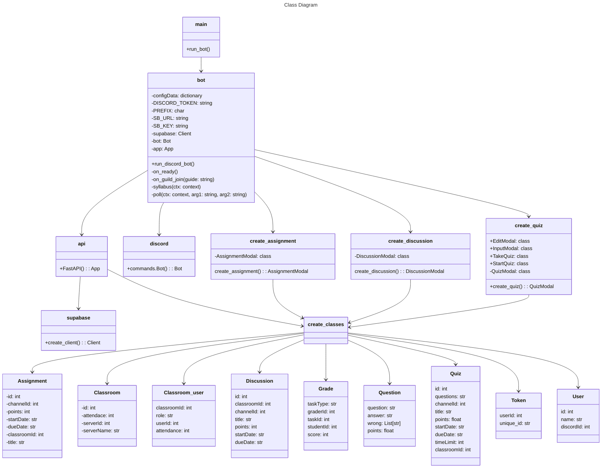
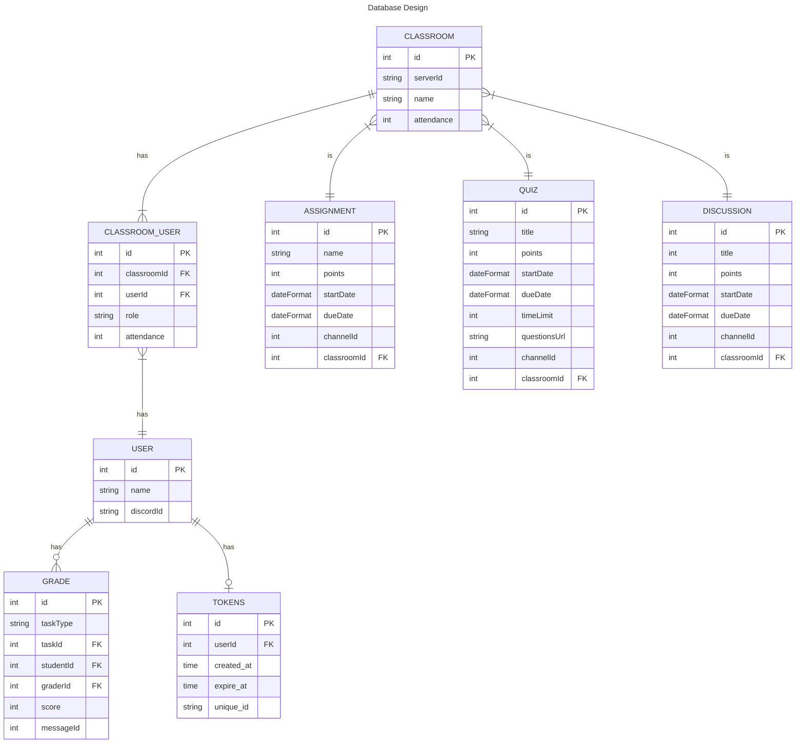
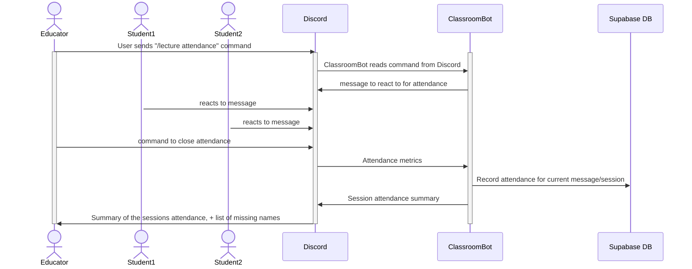
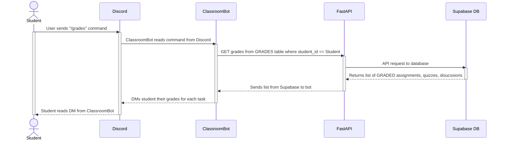
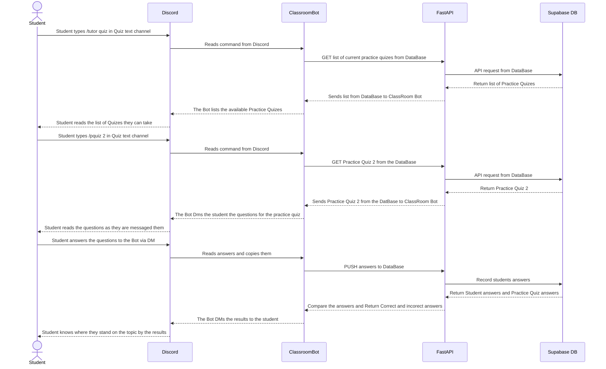
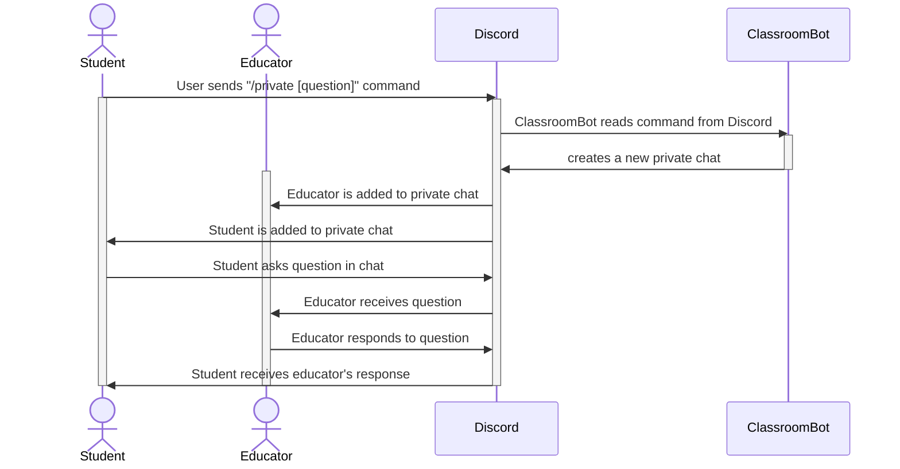
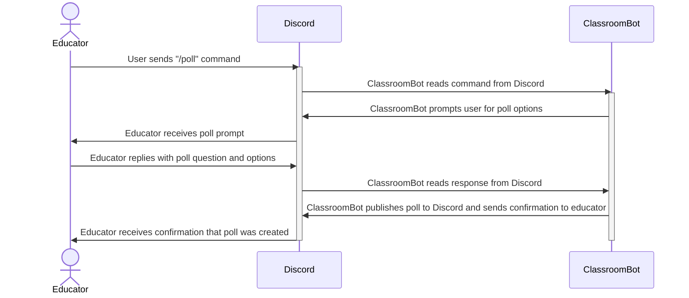
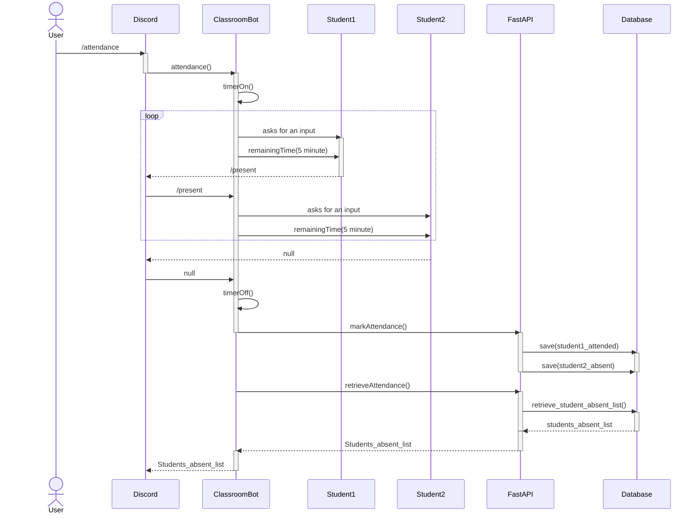

# Architecture

## Class Diagram

The class diagram shows the structure of our project in Python. First, the main.py file calls run_bot() from bot.py. bot.py is connected directly to the discord library to start up the bot. Also it uses the api.py file to connect to the Supabase database. The api.py uses the create_classes.py to create a struct of the values inside of the database. Also, in bot.py there are three classes: create_assignment, create_discussion, and create_quiz which are responsible for sending Modals to users to fill out to generate school work. These modals incorperate the structs from create_classes to easily add to the database.

## Database Design

Each time the bot is added to a Discord server a new row is added to the CLASSROOM table. This table holds discord server name and the total attendance and grade used to calculate student's grades and attendance scores. Each CLASSROOM contains one or more EDUCATORS and one or more STUDENTS. The STUDENT table holds the student's username, the classroom they belong to, their grade, and their attendance score. Their total grade will equal their grade divided by the CLASSROOM totalGrade. Next we have the ASSIGNMENT, QUIZ, and DISCUSSION tables. The ASSIGNMENT table keeps track of the assignments the EDUCATOR creates which includes the name of the assignment, when to make it available, and when its due. The QUIZ table keeps track of EDUCATOR created quizzes which holds the max score of the quiz, the start/due date, and an optional time limit for the quiz. Each QUIZ is made up of QUESTIONS which contain a prompt, a correct answer, and optional wrong answers depending on the type of question. (If no wrong answers then its a open-ended question or fill-in-the-blank, if one wrong answer could be a True/False, and if all wrong answers are given then its multiple choice). The DISCUSSION table is used to keep track of the Discussions within the Discord server. These will only include max scores and start/due dates. Finally the GRADES table holds all of the grades for the students. TOKENS are used to allow users to upload to the website and have a time limit to prevent misuse. 

## Sequence Diagrams

    

### Use Case #1: Educator /lecture attendance command

As an educator, I want to record the attendance of a lecture.

 

1. Educator types `/lecture attendance` command
2. The Bot reads the command and sends an attendance message to the discord
3. The students are able to react to the message
4. The educator sends a command to close the attendance 
5. The bot checks the attendance metrics (by checking the reactions)
6. The bot sends the metrics to the Supabase Database
7. The bot sends the attendance summary to the educator, with a list of missing students
    

    

    

### Use Case #2: Student /grades command

As a student user I want to check my grades for the class.

 

1. The student types `/grades` command within the classroom discord server.
2. The ClassroomBot reads the command from the server
3. Using FastAPI an API GET request is made for the grades
4. The request is forwarded to the Supabase Database
5. Supabase returns the grades for that student as a list
6. FastAPI sends the list to the application
7. The application parses through the grades and neatly organizes them and direct messages the student their grades
8. The student reads their DMs to check their grades.
    

    

    

### Use Case #3: Student takes practice quiz

This Diagram shows the process of a student wanting to take a Practice Quiz.

 

1. Student types `/tutor quiz`
2. The Bot reads the command and sends a request for the list of quizzes available to the API.
3. The API gets the data from the database and returns it to the Bot.
4. The Bot lists the available quizzes.
5. The Student reads the available quizzes and types `/tutor quiz` 2 to take the quiz they want.
6. The bot reads the command and sends the request for the specific quiz to the API.
7. The API gets the questions from the database and returns them to the Bot.
8. The Bot DMs the student the questions.
9. The Student answers the questions.
10. The Bot reads the answers and pushes them to the API.
11. The API pushes the answers to the Database to be saved and then returns the answers key for the quiz and the student's answers.
12. The API compares the two and returns the incorrect and correct answers to the Bot.
13. The Bot messages the Student their results.
14. The student knows where they stand on the topic due to their results.
    

    

    

### Use Case #4: Student wants to ask the educator a question

This diagram shows a student asking a question to the educator by creating a ticket for a private chat

 

1. Student types `/private [question]` command
2. ClassroomBot reads the command from discord
3. The bot creates a new private chat
4. The educator and student are added to the private chat
5. Student can message the question to the educator
6. Educator responds to the students question
7. Student receives the educator's response
    

    

    

### Use Case #5: Educator creates poll with /poll

This diagram shows an educator creating a poll for the students to respond to

 

1. The educator enters the `/poll` command
2. The ClassroomBot reads the command from Discord
3. The bot prompts the user for the poll question and options
4. The educator enters the specified information on Discord
5. The ClassroomBot reads the data from Discord
6. The ClassroomBot formats the poll message and publishes it to Discord
7. The educator receives confirmation that their poll was created
    

    

    

### Use Case #6: Educator takes attendance with /attendance command

This diagram shows the process of recording students attendance. 

 

1. User sends a command to the Discord server to initiate attendance tracking by typing `/attendance`.
2. The Discord server then passes the attendance request to the ClassroomBot.
3. The ClassroomBot starts a timer and begins a loop asking students in the classroom if they are present or not.
4. Student1  responds with present whereas Student2 does not.
5. Once loop is complete, the ClassroomBot deactivates and sends a request to FastAPI to mark the attendance.
6. The FastAPI stores the attendance data in a Database.
7. The FastAPI service then retrieves the list of students who were marked absent in the database and sends it back to the ClassroomBot.
8. The ClassroomBot activates again and receives the list of absent students from the FastAPI service.
9. The ClassroomBot sends the list of absent students to the Discord server for notification to the User.
    

    

