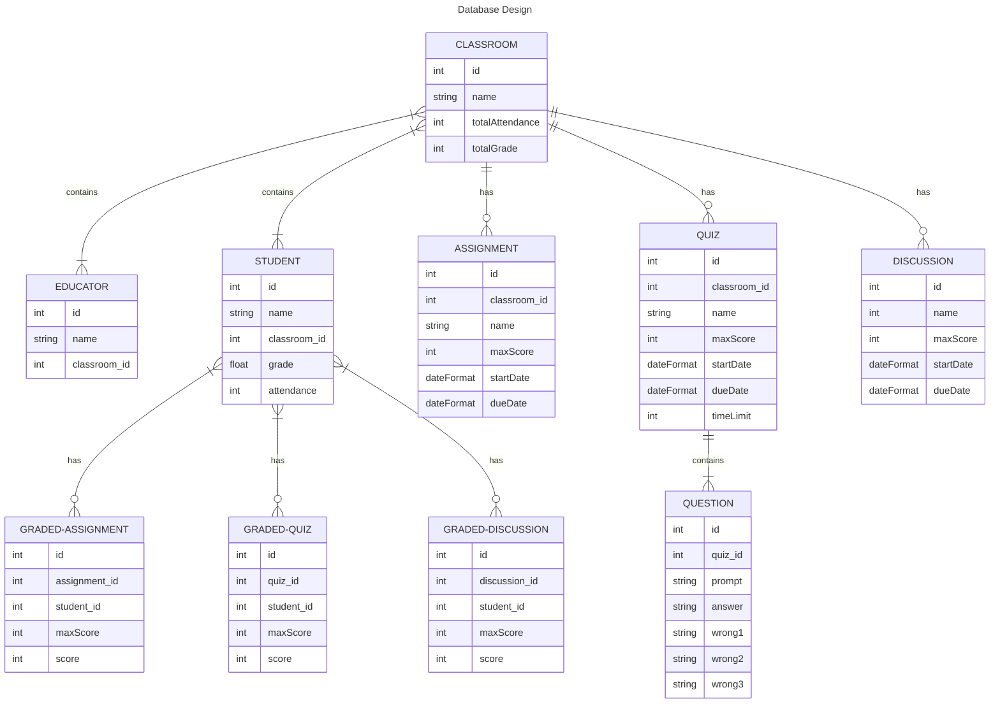
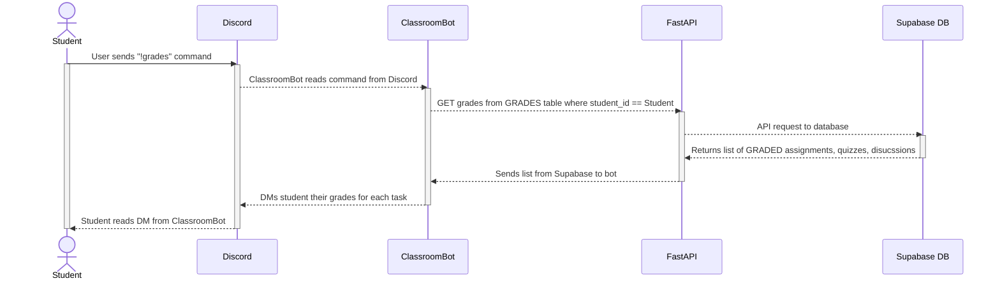

**Purpose**

The Design Document - Part I Architecture describes the software architecture and how the requirements are mapped into the design. This document will be a combination of diagrams and text that describes what the diagrams are showing.

**Requirements**

In addition to the general requirements the Design Document - Part I Architecture will contain:

A description the different components and their interfaces. For example: client, server, database.

For each component provide class diagrams showing the classes to be developed (or used) and their relationship.

Sequence diagrams showing the data flow for _all_ use cases. One sequence diagram corresponds to one use case and different use cases should have different corresponding sequence diagrams.

Describe algorithms employed in your project, e.g. neural network paradigm, training and training data set, etc.

If there is a database:

Entity-relation diagram.

Table design.

A check list for architecture design is attached here [architecture\_design\_checklist.pdf](https://templeu.instructure.com/courses/106563/files/16928870/download?wrap=1 "architecture_design_checklist.pdf")  and should be used as a guidance.

## Database Design

Each time the bot is added to a Discord server a new row is added to the CLASSROOM table. This table holds discord server name and the total attendance and grade used to calculate student's grades and attendance scores. Each CLASSROOM contains one or more EDUCATORS and one or more STUDENTS. The STUDENT table holds the student's username, the classroom they belong to, their grade, and their attendance score. Their total grade will equal their grade divided by the CLASSROOM totalGrade. Next we have the ASSIGNMENT, QUIZ, and DISCUSSION tables. The ASSIGNMENT table keeps track of the assignments the EDUCATOR creates which includes the name of the assignment, when to make it available, and when its due. The QUIZ table keeps track of EDUCATOR created quizzes which holds the max score of the quiz, the start/due date, and an optional time limit for the quiz. Each QUIZ is made up of QUESTIONS which contain a prompt, a correct answer, and optional wrong answers depending on the type of question. (If no wrong answers then its a open-ended question or fill-in-the-blank, if one wrong answer could be a True/False, and if all wrong answers are given then its multiple choice). The DISCUSSION table is used to keep track of the Discussions within the Discord server. These will only include max scores and start/due dates. Finally we have the GRADED tables which are used to hold the scores students got on ASSSIGNMENTS, QUIZZES, and DISCUSSIONS. 

## Sequence Diagrams

### Sequence Diagram #2

__**Figure 3.2 Use Case #2 Sequence Diagram: As a user I want to check my grades or attendance in the class.**__

This diagram shows the process of a student checking their grades (total grade and grade per assignment, quiz, and discussion).

1. The student types "!grades" command within the classroom discord server.
2. The ClassroomBot reads the command from the server
3. Using FastAPI an API GET request is made for the grades
4. The request is forwarded to the Supabase Database
5. Supabase returns the grades for that student as a list
6. FastAPI sends the list to the application
7. The application parses through the grades and neatly organizes them and direct messages the student their grades
8. The student reads their DMs to check their grades.
